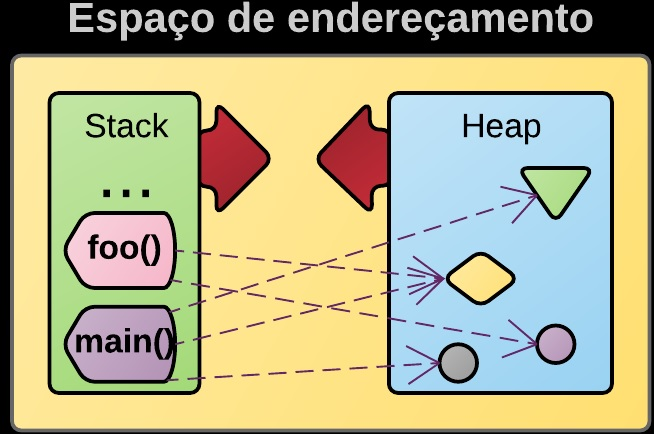
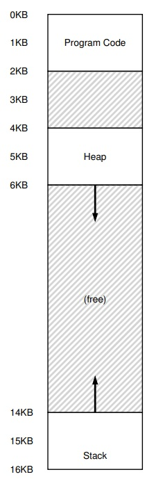
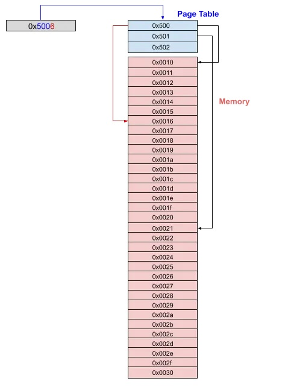
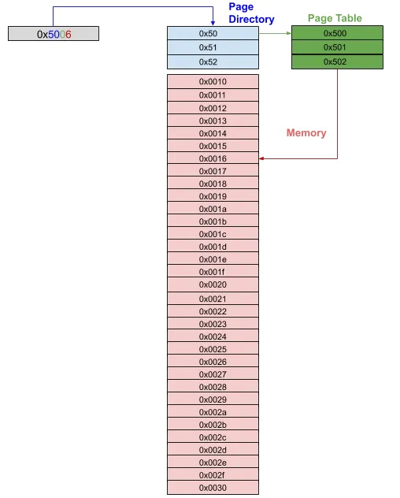

# so
Sistemas Operacionais - Conceitos

## Memória nos sistemas x86

## História
Quando a Intel projetou o x86 pela primeira vez, tinha a ideia de que cada item de memória estaria em um *segmento de memória*. Cada segmento era um pequeno pedaço de memória de um tamanho específico. Cada segmento serviria a um propósito diferente. 

### O registrador de segmento **CS** (Código)
- O segmento de código (CS) seria usado para armazenar código executável.

### O registrador de segmento **DS** (Dados)
- O segmento padrão (DS)* seria usado para armazenar dados. 

### O registrador de segmento **SS** (Pilha)
- O segmento de pilha (SS) conteria informações de pilha.

### O registrador de segmento **ES** (Estendido)
- O segmento estendido (ES) seria usado para qualquer programador pretendido. 

### Os registradores de segmento **FS** e **GS** (auxiliares)
Posteriormente ao conjunto de registradores de segmentos foram acrescentados os registradores FS e GS. Estes não têm um propósito definido pelo processador, mas o programador pode escolher o que usá-los para si mesmo. No final, as CPUs x86 modernas têm os seguintes seletores de segmento: CS, DS, SS, ES, FS, GS.

A menos que você tenha *habilitado a paginação em sua CPU*, seu processador está operando no *modo de segmentação*.

A CPU usa esses segmentos ao executar determinadas instruções. Por exemplo: 
- ao buscar a próxima instrução, a CPU usa o segmento CS para calcular o endereço físico onde a instrução pode ser encontrada;
- Ao usar a instrução *mov*, ele usa **DS**;
- Ao usar *push* ou *pop*, ele usa **SS**;

### Endereçamento no **Modo Real**
Como a CPU x86 começa a rodar no modo real que você provavelmente não quer usar e quer mudar para o modo de 32 bits com paginação habilitada ou modo de 64 bits (também conhecido como modo longo), precisamos alterar o modo de execução de alguma forma. Para fazer isso, precisamos configurar a CPU e executar determinadas instruções. Isso significa que precisaremos trabalhar um pouco (só um pouco) no modo real e entender como a CPU se comporta nesse modo.

## Segmentação de memória no *Modo Real*:
Ao carregar um programa em memória, a CPU 8088 segmenta o programa em 5 áreas:

| Registrador CPU | Área (assembler) | Nome                           | Finalidade                          |
|-----------------|------------------|--------------------------------|-------------------------------------|
| CS              | . Text           | Código                         |                                     |
|                 | . BSS            | Bloco inicializado por símbolo | Variáveis não inicializadas         |
| DS              | . Data           | Dados                          | Variáveis com valores iniciais      |
|                 | . Heap           |                                | Empilhamento de variáveis dinâmicas |
|                 | . Stack          |                                | Empilhamento de ponteiros e funções |

Destacando a porção de memória dinâmica (HEAP) e a porção de memória de apontamentos, ponteiros e funções (Stack).

Como ficaria um único programa (processo) carregado na memória:

Como a CPU inicia no modo real, vamos primeiro falar sobre como a segmentação funciona neste modo.

No modo real, a segmentação é relativamente simples. Um endereço lógico de formato A:B (onde A ∈ [CS, SS, DS, ES, FS, GS]) é usado. Este endereço lógico é então traduzido em endereço físico usando A * 0x10 + B. Como no modo real os registradores são limitados a 16 bits para endereçamento, isso nos permite endereçar 2^16 = 64Kb de memória dentro de um único segmento.

## Segmentação de memória no *Modo Protegido*:
No modo protegido, usamos a mesma forma A:B que no modo real, exceto que no modo protegido A não é um valor absoluto do segmento, mas um seletor de segmento. Seletor é um índice em uma tabela. Cada uma das entradas na tabela descreve o segmento (endereço físico, nível de proteção, etc...). O endereço físico do segmento é lido a partir da entrada da tabela (que também é conhecida como seletor de segmento) e B (também conhecido como deslocamento) é adicionado a esse endereço físico para obter o endereço físico real do local da memória.

Existem duas tabelas onde os seletores de segmento podem ser armazenados. Eles são chamados de **Global Descriptor Table** (também conhecido como **GDT** ) e **Local Descriptor Table** ( **LDT** ).

O que isso significa que antes de podermos mudar nossa CPU para o modo protegido, precisamos configurar pelo menos o **GDT**.

Felizmente, há uma boa chance de você nunca precisar configurar o **GDT** para o modo protegido, pois o x86 pode alternar para o modo protegido com a paginação habilitada diretamente do modo real.

## Paginação de Memória
A paginação é uma maneira diferente de acessar a memória física. Em vez de a memória ser dividida em segmentos, ela é dividida em **páginas** e **quadros**. 

### Quadros (Frames)
Quadros ou Frame é um bloco de memória física de um tamanho específico (por exemplo, 4Kb).

### Páginas (Pages)
Página é um bloco de memória virtual do mesmo tamanho. As páginas são do mesmo tamanho que os quadros. 

### Endereços Físicos x Endereços Virtuais: A inclusão da MMU na CPU
Neste modo o programa não acessa a memória usando o endereço físico. Em vez disso, os endereços de memória virtual são usados. Esses endereços virtuais são traduzidos em endereços físicos pela CPU. Este é um processo muito caro comparado ao acesso direto à memória e quase todas as CPUs têm circuitos adicionais para ajudar com isso. Esse circuito é chamado de **MMU** ou **Unidade de Gerenciamento de Memória**.

A imagem a seguir ilustra o processo de tradução de memória. Tenha em mente que a imagem é bastante simplificada e não representa exatamente o que acontece em uma CPU. No entanto, ilustra conceitos básicos sobre os quais construiremos quando estivermos configurando a paginação.

Para uma CPU traduzir um endereço virtual 0x5006 em um endereço físico, a CPU primeiro pega um prefixo e procura esse prefixo em sua "tabela de páginas" e descobre qual endereço físico está associado a esse prefixo. Por enquanto você pode pensar na tabela de páginas como um lugar especial na CPU. No nosso caso, o endereço físico associado à entrada da tabela de páginas 0x500 é 0x0011. A CPU então pega esse endereço (0x011) e adiciona a última parte do endereço (0x6). 0x0010 + 0x6 = 0x0016. E é assim que a CPU traduz o endereço virtual 0x5006 para o endereço físico 0x0016.

Essa abordagem pode ser estendida para tabelas de páginas de vários níveis:

Na imagem acima, os primeiros dois bytes são usados como índice em "Diretório de páginas". O byte a seguir é usado como índice na "Tabela de páginas" e o último byte é deslocado na página de memória.

Processadores x86 normalmente usam paginação de 3 ou 4 níveis com os mais recentes podendo usar até sistema de paginação de 5 níveis.

